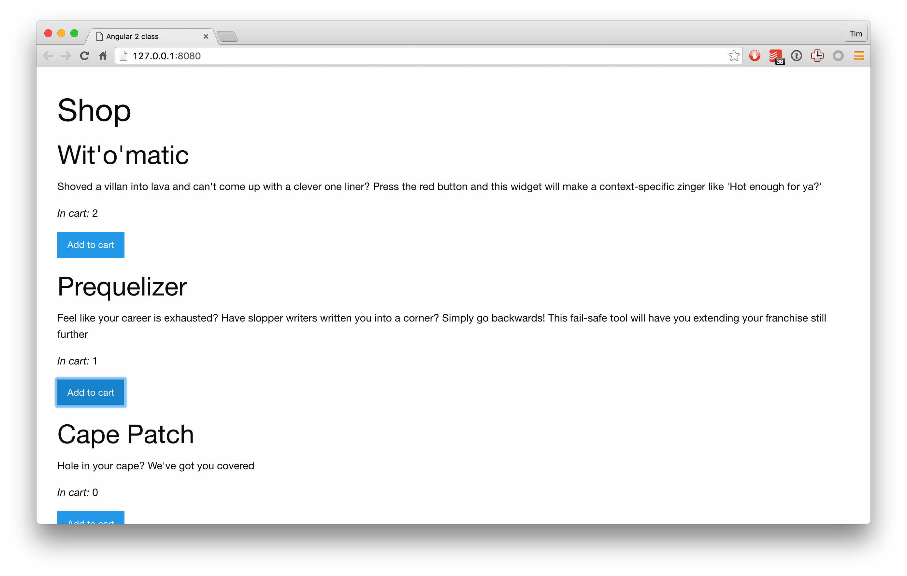

# Built-in directives

## Steps

We want to show an unknown number of products.

### Defining `ProductList`

We're going to define a component to display a list of products.

1. define a `ProductList` component
1. this should accept a list of products
  1. define an `@Input` to accept them

### Using `ngFor`

1. use the `ngFor` directive to create a `<product>` tag per item in the product list
  1. look up a loop-y directive in the cheatsheet
  1. inside the tempate use `*ngFor` to repeat our `product` component
1. pass the product to the `<product>` component via its input

### Including our `ProductList` into the app

1. use our product list to display a list of products
  1. in App, import a longer list products - it's `longerStaticProductList` from `app/productList.fixture`. 
  1. replace our repeated `<product>` with the `<product-list>`
  1. pass in the products to our list component
1. wohoo, more products with less typing!

## Resources

- [Cheatsheet](https://angular.io/docs/ts/latest/guide/cheatsheet.html)

## Goal

