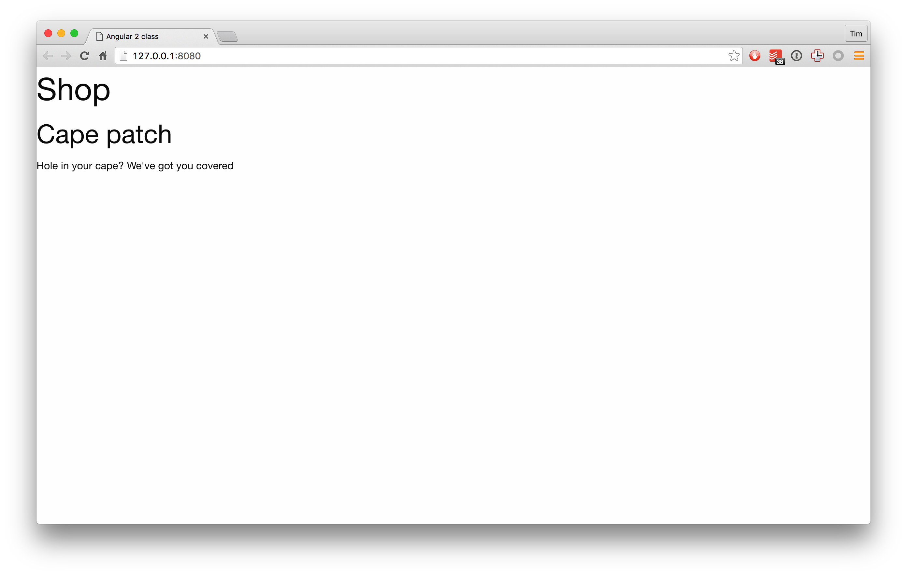

# Components

Write code in `app/app`.

Run `npm start` to:

1. compile your code in `/app/app` on change
1. open a browser to a live-reloading page
1. if you don't see what you expect, right click and click 'Inspect'. Then open the console tab

The below is intended to be a chance to use what you've learned, not a puzzle. If it's not clear what to do, ask me!

## Steps

1. we want to make a component that'll list our products
1. define a new component called `Product` in `/app/app/Product.component.ts`, which binds to `<product>` elements
  1. add in an `<h2>` in its `template:`, and title it "Cape Wax" (or your own super-hero product)"

### Importing and using a component inside another component

1. add a `<product>` tag into the template of `App`
  1. what happens? Think about why
  1. we need to inform Angular we're using a custom component.
1. import `Product` into `App`
  1. will the component know about Product yet?
  1. it won't - we need to explicitly tell it about our component.
    1. in the @Component decorator, add a `directives:` property and set its value to an array containing `Product` 
1. you should now see your `Product` component

## Resources

- [cheatsheet](https://angular.io/docs/ts/latest/cheatsheet.html)

## Goal

