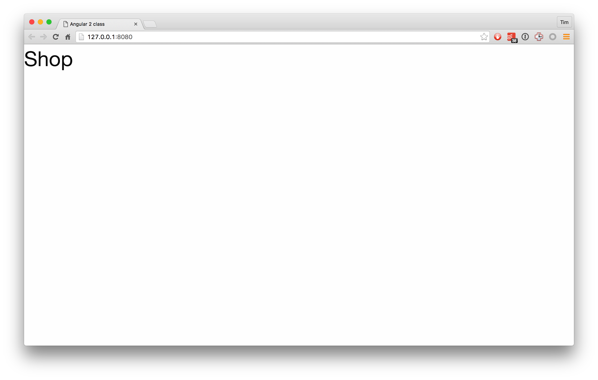

# Hello Angular

Write code in `./exercises/app`.

Run `npm start` to:

1. compile your code in `/app` on change
1. open a browser to a live-reloading page
1. if you don't see what you expect, right click and click 'Inspect'. Then open the console tab

The below is intended to be a chance to use what you've learned, not a puzzle. If it's not clear what to do, ask me!

1. creating our first component
  1. define our first component - `App` class in `app/App.component.ts`
  1. telling Angular about our component
    1. use the `@Component` decorator to ensure Angular knows it's a component
    1. use 'selector:' to select `<app></app>` tags
    1. give it a simple `template:` which displays `<h1>Superhero shop</h1>`
1. booting the application with our component
  1. our component will be the root of the application's component tree
  1. create `app/main.ts` - this will be responsible for starting the app
  1. import the `bootstrap` method - it's in `angular2/platform-browser-dynamic`
  1. import our `App` component
  1. call `bootstrap` with `App` to boot up the application
  1. You should see the HTML from your template
  1. Inspect the page - look for the `<app>` tag, it should have your HTML

## Resources

- [Cheatsheet](https://angular.io/docs/ts/latest/guide/cheatsheet.html)

## Goal

