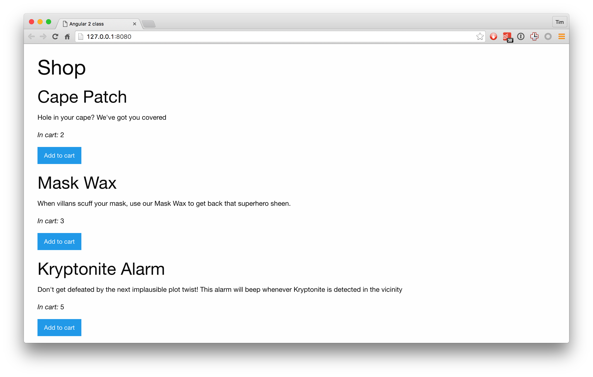

# Inputs

## Steps

1. use this ([cheatsheet](https://angular.io/docs/ts/latest/cheatsheet.html)) for reference - there's lots of syntax!

### Passing in data

We're going to pass data to our `Product` component.

1. we need to get a product to pass to our component
  1. in `App`, import `staticProductList` from `./fixtures`
    1. assign it a property of app
1. we want to pass a product to our `Product` component
  1. pass in `products[0]` to the our `<product>`
  1. check the cheatsheet to see how we do that!
1. oh no! something is wrong in the console
  1. you should see Angular complain that `product` is not a "known native property"
  1. why? we'll fix this in the next step

### Accepting data via `@Input()`

1. we need to tell Angular our `Product` component accepts a product input
1. we need to tell the component it accepts a product via it's `product=` attribute
  1. import the `@Input()` decorator
  1. use the `@Input()` annotation to accept a single `product` as an attribute
1. we also need to handle the product not being there, we will see errors otherwise
  1. is there a template feature we can use?
  1. yes! the 'safe navigation operator' (quiff): `product?.title`
1. let's use the product to stop hard-coding the product
  1. update the template to take in description and title from the `product`
1. let's use our new data-driven component to stamp 3 products!
  1. import the product array from `./fixtures`
  1. create 3 `<product>` components, and pass one product to each

### `ngOnChanges()` hook

1. [EXTRA CREDIT] define a `ngOnChanges(ch) { console.log(ch) }` method in `Product`
  1. what is logged?
  1. how could this be useful?
  1. research `ngOnChanges` - what does it do?

## Goal

