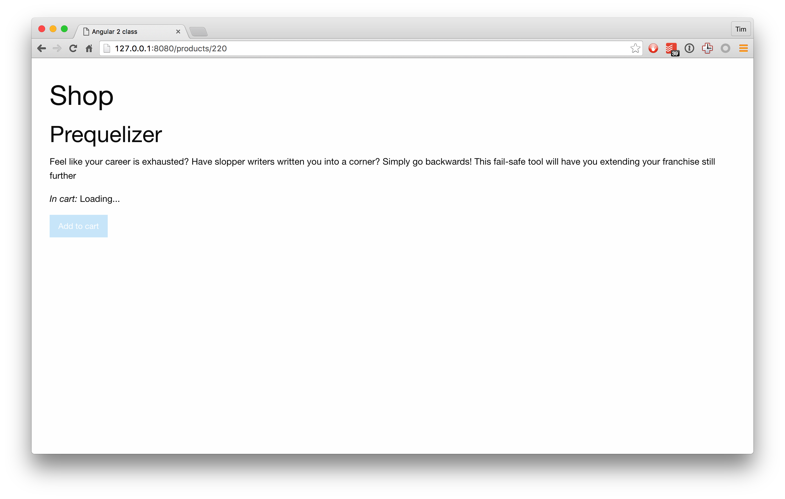

# Outputs

Outputs all us to emit events from our components. The big idea of Angular 2 data-flow is data-down, events up. Outputs are where events come from.

## Steps

- Our add to cart button isn't doing much. Let's fix that!
- We want to use a `Cart` component that holds the products we've bought
  - it's in `app/pre-built` - copy it to `app/app/Cart`
- Our `Product` component needs to react to people clicking on `Add to cart`
  - This is our first `Output`. We want to emit a high-level event each time someone clicks - in other words turning a `DOM` event into a business event
    - First off, import `Output` - this is the `@Output()` decorator - and `EventListener`  from `@angular/core`
    - next remove all the business logic from our component
    - replace it with emitting an event
      - `this.added.emit({ product: this.product });
  - Also - the entries are asynchronous. Update the template to display a loading message while a cart entry is being updated
- In our `ProductPage`, we want to react to items being added to the cart
  - Why not in the `Product`?
    - As it's not a smart component, it shouldn't know about stores
  - We emitted from an emitter called 'added', which means the event will also be called emitted
  - Use the angular template syntax to listen for the `added` event. Make sure to pass the event along
    - `(added)=added($event)`
  - In the handler, call the appropriate method on `Cart`
    `this.cart.add(event.product.id)`
- Add some items to the cart. We should see the number of items in the cart increase, and persist across page loads! 

## Goal

We'll be able to click to add items to cart. This will persist across page refreshes. We'll also make sure to add some feedback when the cart entry is loading.

